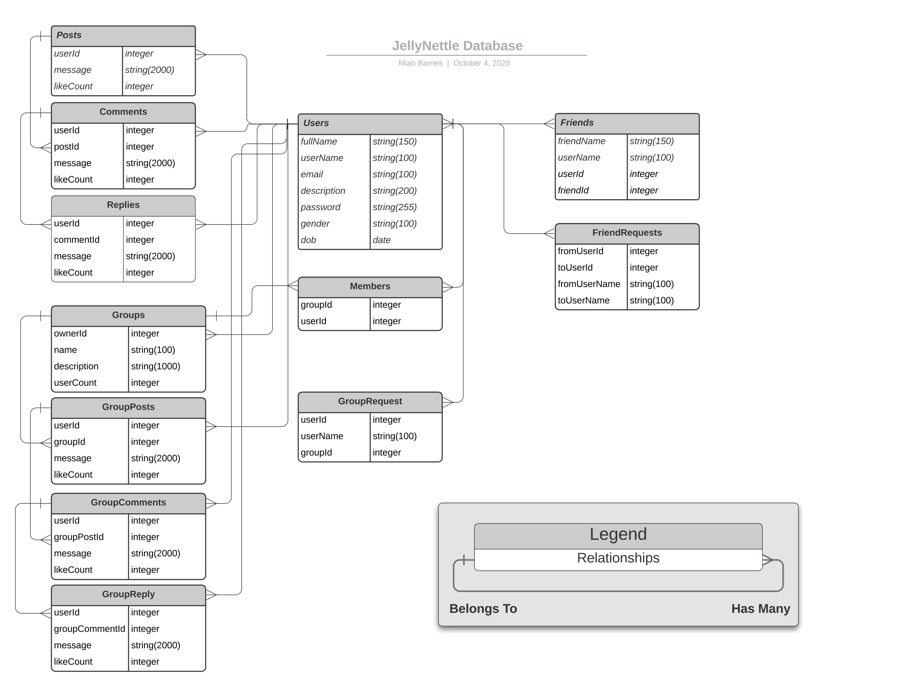

# jellynettle
### The Database
**1.   A Users table with a many relationship for**
  * Comments
  * Posts
  * Likes (Future update)
  * Uploaded images (coming to a future update)
  * One relationship or many with profile pic?
  * groups
  * GroupPosts
  * GroupComments (Future update)
  * GroupReplies (Future update)

**2.   A comments table with a belongs to relationship to a user**
  * Possibly allow for picture comments
  * Possible Giphy comments

**3.   A "Likes" table with a belongs to reltionship to a user**
  * Possible multiple "Like types"

**4.   A Table for posts with a belongs to relationship to a user**
  * Possible images, gifs, etc
  * Posts should have a placeType that will determine if it is public or a group post, maybe a string to reference group table

**5.   Tables for images? gifs? uploading them?**

**6.   Table for groups that has many users**
 * Groups can have a title,
 * Possible group chat/instant messenger if I have time or in the future

 ### Features
 **1.   Should be able to create a profile**

 **2.   Upload a profile pic**

 **3.   Like other posts/comment on posts/create posts**

 **4.   Join groups (Extremely important)**

 **5.   Infinite scroll if time allows/future**

 **6.   Adding freinds**
  * Friend suggestions?

  **7.   Text size limit for messages/comments/posts**

 **8.   If time allows or in the future, instant messaging/group messaging**

### The UI/UX
**1.   Should use React/Redux**

**2.   Should use Material UI**

**3.   Should be intuitive and fun**
